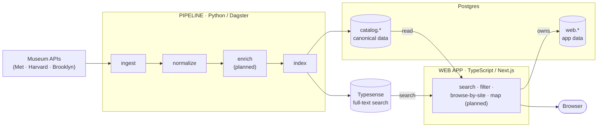

# Hapi — Egyptian Artifacts Index

**A cross-museum, searchable index of ancient Egyptian artifacts, organized by where they were found — so pieces scattered across the world's museums can be virtually reunited with their origin site.**

> Status: early but real. Search across ~36,000 artifacts from three museums works today. The scholarly authority layer that links those artifacts to canonical rulers and sites is the current build focus. See [`docs/PROJECT-STATUS.md`](docs/PROJECT-STATUS.md) for an honest, detailed snapshot.

---

## The problem

When a tomb is excavated, its contents are dispersed. A single burial can end up split across the Met, the British Museum, Cairo, Berlin, Brooklyn, and a dozen others — each museum holding a fragment, each describing it in its own catalog, its own vocabulary, its own API. "Thutmose III," "Menkheperre," "Thoutmôsis III," and "Tuthmosis III" are the same king; "Thebes," "Waset," and "Luxor" overlap in ways no single catalog reconciles. There is no shared index that lets you stand back and see everything that came from one place.

Hapi builds that index. It ingests artifact data from many museums, normalizes it to one canonical schema, resolves the names against scholarly authority lists, and organizes the result by origin site — so you can search across institutional boundaries and begin to reassemble what was once together.

## What it is, from a distance

Two independent systems share one database:



- **Pipeline** (`pipeline/`, Python + [Dagster](https://dagster.io/)) — ingests museum API responses verbatim, maps each museum's shape into one canonical artifact schema, enriches with scholarly authority data, and syncs the result into a search index.
- **Web app** (`web/`, TypeScript + Next.js) — search, faceted filtering, browse-by-site, and (planned) a map view over the indexed data, with license-aware image rendering.
- **Shared database, separate ownership** — the pipeline owns the `catalog.*` schema (SQLAlchemy/Alembic); the web app owns `web.*` (Drizzle) and generates its TypeScript types by introspecting `catalog.*`. One source of truth, no hand-maintained duplication. See [ADR-011](docs/adr/011-schema-ownership.md).

## Zooming in: the parts that make this hard

This is not a CRUD app. Most of the engineering is in making heterogeneous, often-contradictory scholarship into data you can trust and reproduce.

- **A source-attributed authority claim graph.** Rulers, dynasties, and sites don't have one agreed truth — different scholars order Dynasty 22 differently, spell names differently, and disagree on dates. Rather than flatten that into a single "winner," Hapi models the authority layer as a CIDOC CRM claim graph where every fact is attributed to its source and conflicting claims coexist. A two-stage matcher (deterministic candidate generation → LLM reviewer → human escalation on genuine ambiguity) proposes cross-source identities without silently collapsing them. See [ADR-018](docs/adr/018-authority-as-claim-graph.md).

- **Reproducible extraction from scanned scholarship.** Several authority sources exist only as scanned books. Hapi extracts them with a deterministic, auditable pipeline: OCR → three independent extraction agents → a merge step that requires genuine agreement (unanimity, a real majority, or a cited human override — never an arbitrary tie-break) → schema review → tests. Every committed fact traces back to a page citation. See [`docs/playbook-phase-0-ocr-transcription.md`](docs/playbook-phase-0-ocr-transcription.md).

- **Rules enforced by machines, not by good intentions.** The project runs on a set of [constitutional rules](CLAUDE.md#constitutional-rules) — work like a scholar (every fact traces to a committed source), no silent fallbacks (ambiguity raises loudly), license-before-render, single source of truth. Wherever a rule *can* be a test or a CI check, it is one — including the rule that keeps copyrighted source material out of the public tree.

- **Rights-aware by construction.** Copyrighted source PDFs never enter this repository; only derived, page-cited factual extracts do, and a CI test enforces it. At display time, no image renders without first checking its license field. See [`NOTICE`](NOTICE) and [the rights policy](docs/playbook-phase-0-ocr-transcription.md).

## Where it is right now

- ✅ **Working end-to-end:** three museums (Met, Harvard, Brooklyn) → ~36,000 normalized artifacts → full-text search with faceted filters (museum, period, dynasty, ruler, site, object type) and license-aware images.
- ✅ **Authority sourcing nearly complete:** ~4,600 reconciled, page-cited facts extracted from 11 scholarly works, all passing strict structural and value tests.
- 🟡 **In progress:** the curation step that turns those 4,600 facts into consolidated authority files and links each artifact to its canonical ruler and origin site. Until that lands, artifacts are searchable but not yet *reunified*.
- 🔜 **Planned:** artifact detail pages, browse-by-site, map view, companion-piece discovery.

Full detail, including per-source progress and an honest "works vs. aspirational" breakdown, is in [`docs/PROJECT-STATUS.md`](docs/PROJECT-STATUS.md).

## Getting started

Requires Docker, Python (via [uv](https://github.com/astral-sh/uv)), and Node (via pnpm).

```bash
# Infrastructure: Postgres + Typesense
docker compose up -d

# Pipeline
cd pipeline && uv sync
uv run alembic upgrade head      # apply DB migrations
uv run dagster dev               # launch the Dagster UI to run ingest/normalize/index
uv run pytest                    # run the pipeline test suite

# Web app (../web — sibling of pipeline/)
cd ../web && pnpm install
pnpm dev                         # dev server at http://localhost:3000
pnpm test                        # component tests
```

## Repository layout

```
pipeline/      Python + Dagster: ingest, normalize, enrich, index
  pipeline/authority/   scholarly authority sources + the claim-graph model
  tests/                fixture-based tests (real museum API responses)
web/           Next.js + TypeScript: search UI, filters, license-aware rendering
docs/          architecture decisions (ADRs), PRD, playbooks, museum API notes
CLAUDE.md      working agreement + the constitutional rules the project runs on
```

## Deeper documentation

- **Architecture decisions:** [`docs/adr/`](docs/adr/) — 18 individual decision records.
- **Product requirements:** [`docs/prd.md`](docs/prd.md)
- **Project status:** [`docs/PROJECT-STATUS.md`](docs/PROJECT-STATUS.md)
- **Authority sourcing protocol:** [`docs/playbook-phase-0-ocr-transcription.md`](docs/playbook-phase-0-ocr-transcription.md)
- **Per-museum API notes:** [`docs/museum-sources/`](docs/museum-sources/)

## License & attribution

First-party code and documentation are licensed under the **Apache License 2.0** — see [`LICENSE`](LICENSE).

This project incorporates third-party data and specifications under their own terms (CIDOC CRM, the iDAI gazetteer, and pharaoh.se under CC BY 4.0; museum data under each museum's terms). Attributions are recorded in [`NOTICE`](NOTICE) and must be preserved. Copyrighted scholarly works are cited but **not** redistributed here.

---

*Hapi is named for the ancient Egyptian deity of the Nile's annual inundation — the flood that brought scattered silt together and made the land whole again.*
